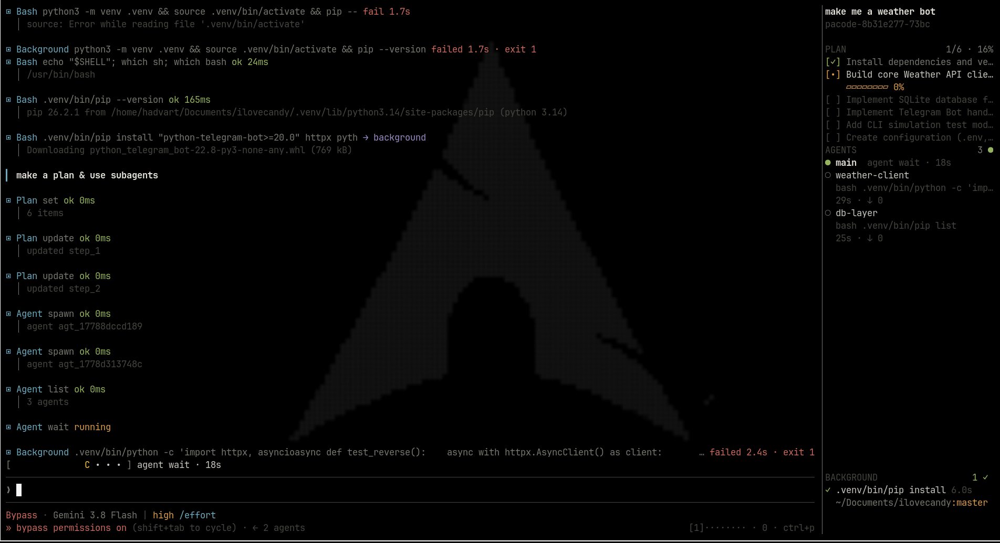
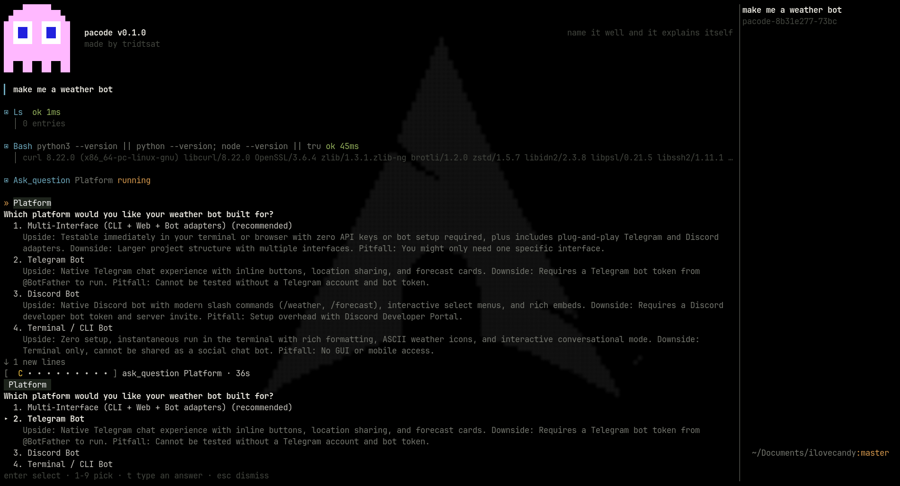

<div align="center">


**A coding agent that lives in your terminal.** Written in Rust, one binary, no runtime.

[](LICENSE)
[](https://www.rust-lang.org)
[](#status)

</div>

> **Status: work in progress.** It builds, it runs and it is used daily, but the
> API and the config are still moving. Proper documentation and a contributing
> guide are coming shortly; until then this README is the documentation.

A background daemon owns the sessions; the TUI is a thin client that attaches to
it. Close the terminal and the work keeps running — reattach and it is still
there, transcript and all.



## Why another one

Because the ones that exist are heavy. pacode is built so that the cheap thing is
the default:

| | pacode | a typical Electron/Node agent |
|---|---|---|
| Daemon at rest | **17 MB RSS, 0.0% CPU** | hundreds of MB, always warm |
| Daemon + 3 clients | **25.9 MB PSS** (+4.9 MB per client) | one process per window |
| First TUI frame | **6.5 ms** | seconds |
| Binary | one 43 MB static-ish executable | a runtime plus a node_modules tree |

Those are measured, not aspirational. "Economy" is a rule in this repository, not
a nice-to-have: every cache states its cap, its invalidation and its owner, and
**nothing is allowed to tick while the session is idle.** A scheduled job a day
away costs one wakeup a minute to redraw its countdown, not sixty.

## Install

```sh
cargo install pacode
```

Or from source, which is what you want if you intend to change anything:

```sh
git clone https://github.com/tridtsatx/pacode.git
cd pacode
cargo build --release
install -m755 target/release/pacode ~/.local/bin/pacode
```

Rust stable, edition 2024. No containers, no runtime, nothing else to install.

## Use it

```sh
pacode                      # attach to the daemon, or start one
pacode "fix the flaky test" # start with a prompt
pacode -s ses_abc123        # resume a session
pacode run --json "..."     # headless, one turn, events on stdout
```

Configuration lives in `~/.config/pacode/config.toml`; `/config` edits it from
inside the TUI.

## What it does

**Sessions that outlive the terminal.** The daemon holds the session, the client
attaches. Nine numbered slots, `ctrl+alt+1`…`ctrl+alt+9`, switch between
conversations over one connection; the inactive ones drop their heavy structures
and cost about 64 bytes each.

**Subagents.** Spawn them, watch them in the rail, select one and its conversation
takes over the column (`ui.agent_view = "panel"` splits instead). They report back
as an injection between steps, never mid-stream.

**Background commands.** A foreground command that outlives five seconds moves to
the background on its own and keeps going; the rail tracks it, and the model is
told when it ends. Long jobs are reported once, in the transcript, and only when
they ran long enough to be worth the interruption.

**Scheduled work.** `cron` runs a prompt on a schedule — `every 30m` or a
five-field cron expression evaluated in UTC — and survives a daemon restart.
`monitor` watches one condition (a command exiting 0, a process gone, a file
appearing or matching) and tells the model once it comes true, so a turn never
blocks on a wait.

**Questions.** The model can put a decision to you with real options, one marked
as recommended, and wait for the answer the way a permission prompt waits.



**Plugins.** A marketplace in the Claude Code layout, so plugins written for it
work here unchanged: `/plugins` browses, installs and removes them. Skills and MCP
servers from an installed plugin are wired up; what pacode will not run is said
plainly rather than dropped in silence.

**Permissions.** Four modes — build, auto, plan, bypass — over a matrix keyed on
what a tool actually does. Classification fails *closed*: a tool pacode cannot
classify asks, it does not assume.

**MCP.** Servers from your config, plus the ones plugins bring. `pacode import`
picks up servers and skills you already have from Claude Code, Codex, OpenCode,
Cursor, Gemini CLI and VS Code.

**ACP.** `pacode acp` runs it as an Agent Client Protocol agent over stdio, for
editors that speak it.

## In the TUI

| | |
|---|---|
| `alt+↑` / `alt+↓` | move through agents and tasks |
| `alt+1`…`alt+9` | select an agent |
| `ctrl+alt+1`…`ctrl+alt+9` | switch session slot |
| `alt+b` | follow the selected agent |
| `alt+f` | files this turn touched |
| `alt+r` | plan and agents (the only way to reach them under 80 columns) |
| `.` | background tasks |
| `ctrl+v` | paste — an image when the clipboard holds one, text otherwise |
| click a tool call | expand its whole output; click again to fold |
| `shift+tab` | cycle permission mode |
| `ctrl+c` twice | quit |

`/model`, `/effort`, `/mode`, `/theme`, `/config`, `/sessions`, `/mcp`,
`/plugins`, `/keys`, `/editor`, `/import`, `/compact`, `/export`, `/help`.

Every binding is rebindable from `/keys`.

## Layout

Nineteen crates, each with one job:

| | |
|---|---|
| `pacode-types` | wire types and pure logic — no IO, no tokio, few dependencies |
| `pacode-core` | the turn loop, sessions, agents, permissions, scheduling |
| `pacode-daemon` | the server: sockets, connections, lifecycle |
| `pacode-tui` / `pacode-render` / `pacode-client` | the terminal client |
| `pacode-provider` | model providers and the catalog |
| `pacode-tools` | the built-in tool set |
| `pacode-exec` | supervised processes, output spooling, progress parsing |
| `pacode-store` | SQLite on a worker thread, with FTS5 search |
| `pacode-mcp` / `pacode-plugin` / `pacode-skills` / `pacode-acp` | the edges |

House rules: modules under 500 lines, exhaustive matches, no `unwrap()` outside
tests, `thiserror` in public APIs, and a clean `cargo clippy --workspace
--all-targets` on every commit.

## Status

Work in progress, and honest about it:

- **Works today:** sessions, subagents, permissions, background commands, cron
  jobs and monitors, questions, MCP, plugins and the marketplace, skills, ACP,
  import from other agents.
- **Coming shortly:** proper documentation, a contributing guide, and the
  remaining tabs of the plugin screen.
- **Not there yet:** Windows (Unix sockets and process groups are assumed), and
  running Claude Code hooks or markdown slash commands from a plugin.

Issues and pull requests are welcome meanwhile; the checks below are what CI will
run.

## Contributing

```sh
cargo fmt
cargo clippy --workspace --all-targets   # must be silent
cargo test --workspace
```

Tests live next to what they test, in `*_tests.rs`. Anything that reaches the
model is size-capped; anything that caches states its cap, its invalidation and
its owner. If a fix needs a hack, say so in the code with the condition for
removing it.

## Prior art

pacode is not the first terminal coding agent and does not pretend to be. It was
built while reading, and borrowing ideas from:

- [Claude Code](https://www.anthropic.com/claude-code) — the shape of the whole
  thing: the turn loop, permission modes, subagents, skills, and the plugin
  format this marketplace speaks. Not open source; the influence is on the
  design, not the code.
- [OpenCode](https://github.com/sst/opencode) — a daemon a thin client attaches
  to, and sessions that outlive the terminal.
- [Codex](https://github.com/openai/codex) — supervised process execution and
  output handling; the head/tail output buffer here is a port of its idea.
- [jcode](https://github.com/1jehuang/jcode) — the most RAM-efficient harness,
  and the reason this one measures itself at all; the rail layout and much of the
  TUI vocabulary came from reading it.

## License

Apache 2.0. See [LICENSE](LICENSE).
